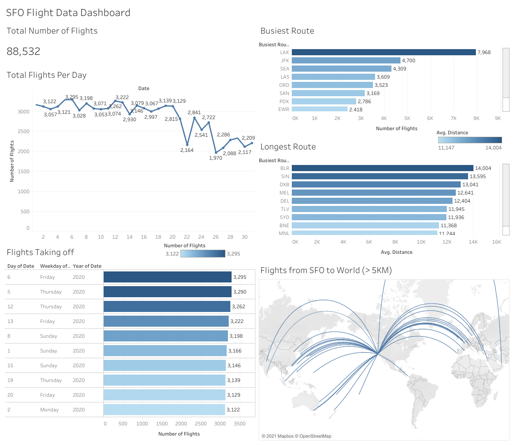

# SFO_Flight_Data_Tableau_Viz
My First Tableau Mini Project on SFO Flight Data

# Objective
## Aims to answer few of the questions below:

What are the total number of flights in the dataset?

Find the busiest day at SFO Aiport. 

What are the total number of flights per day in a month?

What are the top 10 busiest flight routes out of SFO? 

Which are the top 10 longest flight routes out of SFO? 

Represent the flights flying outside SFO towards different part of the world. 

# Project 

Tableau Public URL: https://public.tableau.com/app/profile/chekwei/viz/SFOFlightData_16240931133110/SFOFlightDataDashboard

# Conclusions

1. Over 88k flight data recorded in the dataset. 

2. Busiest day happened on 6th March (Friday) 2020. Among top 10 busiest days, most are towards end of the week (Thurs-Sun)

3. Overall, least number of flights per day was 1970 and max flight was 3295. 

4. Busiest route from SFO is to LAX (Los Angeles International Airport)

5. Longest route from SFO is to BLR (Bangalore International Airport), around 14,000 KM. Next is SIN (Singapore International Airport) at around 13,500 KM.

# Credits
Dataset: https://drive.google.com/file/d/1HZSYZWoBrV926mnUTmvpjGmxRaKN4cQF/view?usp=sharing

Tutorial: https://www.youtube.com/watch?v=C116gs2Y1nU
